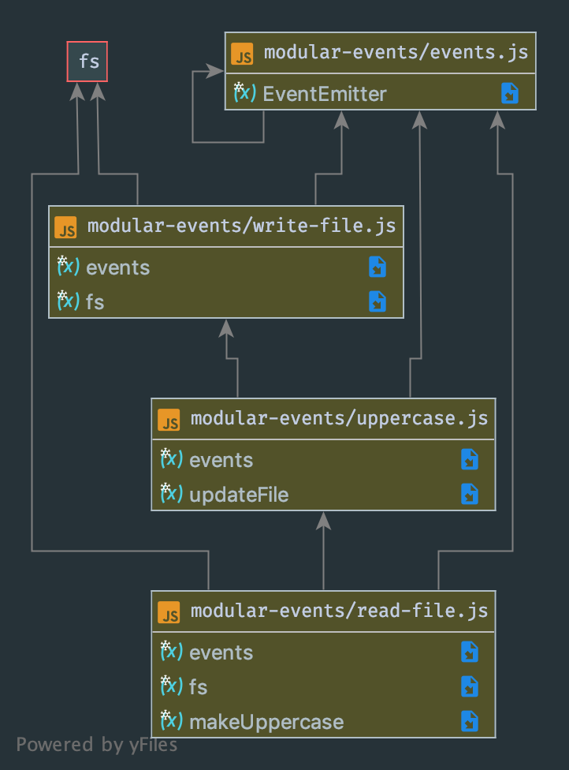

# LAB - 16

 ## Event Driven Applications

 ### Author: Evan Brecht-Curry

 ### Links and Resources
* [submission PR](https://github.com/evan-401-advanced-javascript/lab-16-event-driven-applications)
* [travis](https://www.travis-ci.com/evan-401-advanced-javascript/lab-16-event-driven-applications)
* [docs](http://localhost:3000/docs/)

 ##### Exported Values and Methods
`processFile - Function uses fs to read file and then uses emitter to call uppercase.`
`makeUppercase - Function turns the data file to a string and call the write function`
`updateFile - Function writes changes made back to the file.`
`alterFile - Function uses emitter to pass the file name to the read function`

### Setup
#### `.env` requirements
none

 #### UML
